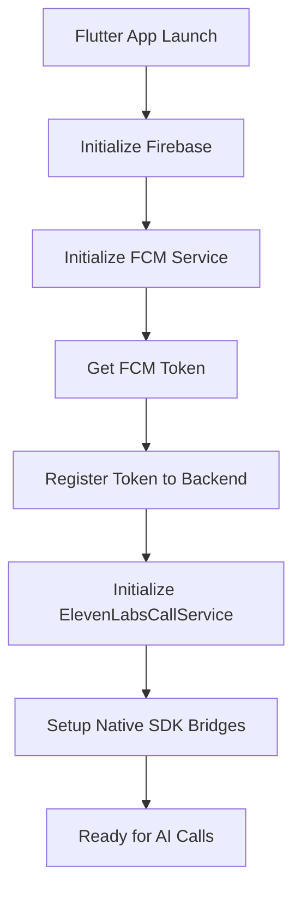
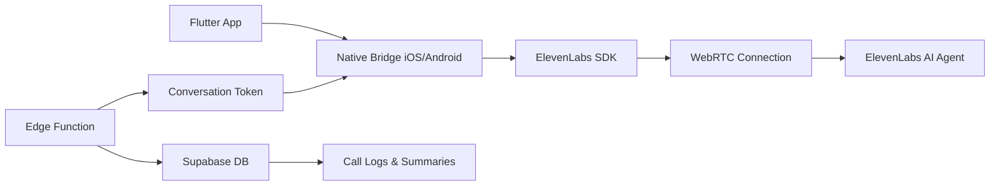
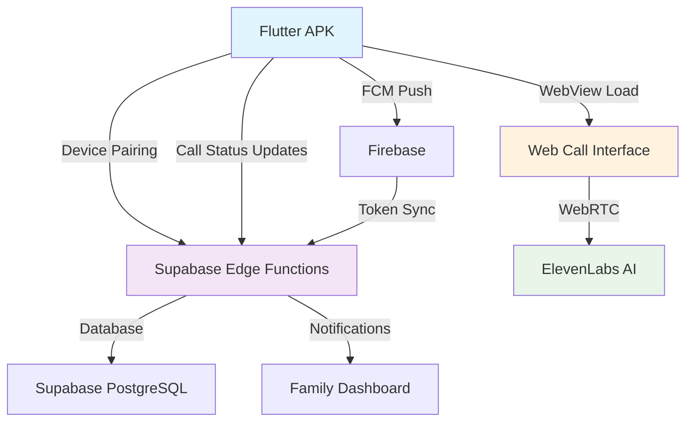
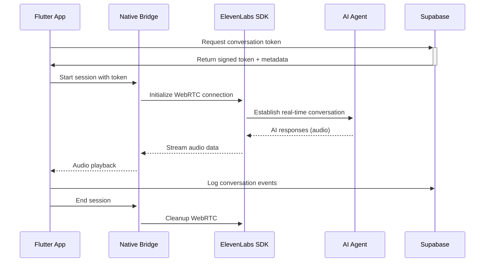
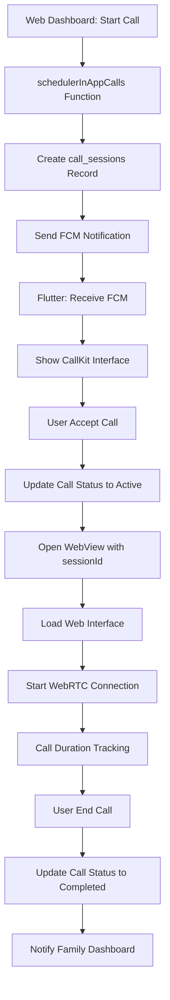

# CallPanion Flutter APK - Complete Integration Guide (Updated 2025)

## 📋 System Overview

APK Flutter ini adalah komponen kunci dalam ekosistem CallPanion yang menangani:
- ✅ **ElevenLabs WebRTC Conversational AI** - Direct native SDK integration untuk real-time voice calls
- ✅ **Native CallKit** untuk iOS/Android call interface dengan validasi household
- ✅ **Cross-Platform Push Notifications** - iOS APNS VoIP + Android FCM dengan household isolation
- ✅ **Native iOS VoIP Integration** - 🆕 Full APNS VoIP support untuk seamless iOS call experience
- ✅ **Secure Device pairing** dengan household-specific 6-digit codes dan JWT validation
- ✅ **Real-time Call status synchronization** dengan security context
- ✅ **Family notifications** dengan cross-household protection
- ✅ **Connection testing** dan security diagnostics
- ✅ **Device fingerprinting** untuk enhanced security validation

## 🎯 WebRTC Conversational AI Integration (NEW)

### ElevenLabs Native SDK Integration
CallPanion sekarang menggunakan **ElevenLabs Conversational AI** melalui native SDK integration yang memberikan:

#### ✨ Key Features:
- **Real-time Voice Conversations**: Direct WebRTC connection ke ElevenLabs untuk natural voice interactions
- **Native Performance**: iOS Swift dan Android Kotlin bridges untuk optimal performance
- **Dynamic Variables**: Pass household/relative context ke AI conversation secara secure
- **Session Management**: Proper start/end session handling dengan conversation tracking
- **Microphone Control**: Mute/unmute functionality dan permission handling

#### 🔧 Technical Architecture:
```
Flutter App ─→ Native Bridge (iOS/Android) ─→ ElevenLabs SDK ─→ WebRTC
     ↓                    ↓                        ↓
Edge Function ←─── Conversation Token ←──── ElevenLabs API
     ↓
Supabase DB (call_logs, call_summaries)
```

#### 🛠 Required Dependencies:
- **iOS**: ElevenLabsSDK via Swift Package Manager
- **Android**: ElevenLabs SDK via Gradle
- **Flutter**: Method channels untuk native communication
- **Edge Functions**: `elevenlabs-device-call` untuk token generation

#### 🔐 Security Features:
- **Household Scoped Tokens**: Setiap conversation token terikat ke specific household
- **Device Authentication**: Pairing token validation sebelum generate conversation token
- **Session Tracking**: Semua conversations tercatat di database dengan proper RLS
- **Dynamic Variables**: Secure passing of household_id, relative_id, session metadata

## 🎯 Flutter APK Responsibilities (Security Enhanced)

### 1. **Secure Device Registration & Authentication**
- Register FCM token (Android) dengan household context dan device fingerprinting
- Register VoIP token (iOS) untuk APNS VoIP dengan household validation
- 🆕 Automatic platform detection dan proper token routing (iOS→APNS, Android→FCM)
- Pair device dengan household melalui secure 6-digit code dengan JWT validation
- Maintain device status dan heartbeat dengan security checks
- Validate device ownership dan prevent cross-household access

### 2. **Cross-Platform Incoming Call Management** 🆕
- **iOS**: Native APNS VoIP notifications untuk instant call interface tanpa app background
- **Android**: FCM notifications dengan CallKit integration dan background service
- Verify call ownership sebelum display CallKit interface dengan household validation
- Handle call accept/decline/timeout dengan security context dan platform-specific logic
- Update call status ke backend dengan household verification dan cross-platform support
- Prevent cross-household call hijacking dengan enhanced token validation

### 3. **Secure WebView Call Interface**
- Load web interface dengan session authentication dan household context
- Pass session parameters dengan security tokens
- Monitor call duration dan status dengan RLS protection
- Handle call completion dengan proper security cleanup
- Inject security headers dan device validation

### 4. **Enhanced Background Processing**
- Process push notifications dengan household filtering
- Maintain device connectivity dengan security monitoring
- Auto-sync dengan backend dengan authentication refresh
- Handle emergency alerts dengan proper authorization
- Log security events untuk audit trails

## 🆕 iOS APNS VoIP Integration (Latest Implementation)

### 🎯 Native iOS VoIP Push Notifications
CallPanion sekarang mendukung **native iOS APNS VoIP** untuk memberikan pengalaman call yang seamless di iOS:

#### ✨ Key Features iOS APNS VoIP:
- **Instant Call Interface**: CallKit muncul langsung tanpa perlu app background
- **Native VoIP Experience**: Sama seperti panggilan telepon biasa di iOS
- **Better Performance**: Menggunakan APNS VoIP channel yang dedicated untuk calls
- **No Background Limitations**: iOS tidak throttle VoIP notifications
- **Platform-Specific Routing**: Automatic detection iOS→APNS VoIP, Android→FCM

#### 🔧 Technical Implementation:
```
Scheduler → Platform Detection → iOS: APNS VoIP / Android: FCM
     ↓              ↓                    ↓              ↓
Edge Function → send-apns-voip    /  send-fcm-notification
     ↓              ↓                    ↓              ↓
iOS Device ←─ APNS VoIP Push    /  Android ←── FCM Push
     ↓                                   ↓
CallKit Interface              CallKit + Background Service
```

#### 📱 Updated iOS AppDelegate.swift:
- Enhanced VoIP notification handling
- Support untuk multiple notification types (incoming_call, call_scheduled)
- Improved logging untuk debugging
- Automatic CallKit interface triggering

#### 🔐 Security & Validation:
- Household-scoped VoIP tokens (sama seperti FCM)
- Cross-household call prevention
- Device ownership validation
- Enhanced audit logging untuk iOS calls

## 🔧 Backend Integration Components (Security Enhanced)

### Edge Functions yang Digunakan ✅
1. **`register-fcm-token`** - Secure device token registration dengan household validation dan device fingerprinting
2. **`updateCallStatus`** - Real-time call status updates dengan RLS dan household verification
3. **`send-fcm-notification`** - Trigger CallKit notifications dengan household filtering (Android)
4. **`send-apns-voip-notification`** - 🆕 Trigger native iOS VoIP calls melalui APNS VoIP
5. **`send-push-notification`** - 🆕 Platform router untuk iOS APNS VoIP & Android FCM dengan fallback
6. **`schedulerInAppCalls`** - Schedule dan dispatch calls dengan cross-platform routing security
7. **`check-scheduled-calls`** - Poll upcoming calls dengan household isolation
8. **`device-heartbeat`** - Device connectivity monitoring dengan authentication
9. **`pair-claim`** - Secure device pairing dengan household JWT validation
10. **`getRtcToken`** - Generate secure WebRTC tokens dengan session verification
11. **`elevenlabs-webhook`** - Handle call completion dengan security validation

### Database Tables Integration ✅ (RLS Protected)
- **`push_notification_tokens`** - FCM/VoIP token storage dengan household_id scoping
- **`call_sessions`** - WebRTC session management dengan RLS policies
- **`call_logs`** - Call history dengan household isolation dan security context
- **`device_pairs`** - Secure device pairing dengan unique constraints
- **`pairing_tokens`** - Session-specific pairing dengan expiration
- **`notification_history`** - Push notification audit dengan security logging
- **`relatives`** - Relative data dengan household-specific RLS
- **`household_members`** - User-household mapping dengan role-based access

## 📱 Critical Flutter APK Requirements untuk In-App Call System

### 🎯 **System Specifications & Hardware Requirements**

#### **Minimum Device Requirements**
- **Android**: API Level 21+ (Android 5.0+)
- **iOS**: iOS 12.0+
- **RAM**: Minimum 2GB untuk stable call performance
- **Storage**: 100MB free space untuk app + cache
- **Network**: 4G/WiFi dengan minimum 1Mbps untuk video calls
- **Camera/Mic**: Diperlukan untuk WebRTC calls

#### **Permissions yang WAJIB untuk In-App Calls**
```xml
<!-- Android - Critical Permissions -->
<uses-permission android:name="android.permission.INTERNET" />
<uses-permission android:name="android.permission.CAMERA" />
<uses-permission android:name="android.permission.RECORD_AUDIO" />
<uses-permission android:name="android.permission.MODIFY_AUDIO_SETTINGS" />
<uses-permission android:name="android.permission.USE_FULL_SCREEN_INTENT" />
<uses-permission android:name="android.permission.VIBRATE" />
<uses-permission android:name="android.permission.FOREGROUND_SERVICE" />
<uses-permission android:name="android.permission.WAKE_LOCK" />
<uses-permission android:name="android.permission.SYSTEM_ALERT_WINDOW" />
<uses-permission android:name="android.permission.RECEIVE_BOOT_COMPLETED" />
```

#### **iOS Info.plist Requirements** 🆕 APNS VoIP Ready
```xml
<!-- iOS - Critical Keys untuk APNS VoIP Integration -->
<key>NSCameraUsageDescription</key>
<string>CallPanion needs camera access for video calls with family</string>
<key>NSMicrophoneUsageDescription</key>
<string>CallPanion needs microphone access for voice calls</string>
<key>UIBackgroundModes</key>
<array>
    <string>audio</string>
    <string>voip</string>
    <string>background-processing</string>
    <string>remote-notification</string>
</array>
<!-- VoIP Certificate Entitlements -->
<key>aps-environment</key>
<string>production</string> <!-- or 'development' for testing -->
```

### 🔧 Dependencies yang Wajib Ada (ElevenLabs WebRTC Integration)
```yaml
# pubspec.yaml - Dependencies Core untuk ElevenLabs WebRTC Calls
dependencies:
  flutter:
    sdk: flutter
  firebase_core: ^2.24.2          # Firebase initialization
  firebase_messaging: ^14.7.10    # FCM push notifications
  flutter_callkit_incoming: ^2.0.0 # CallKit native interface - CRITICAL
  http: ^1.1.0                     # API communication
  shared_preferences: ^2.2.2      # Local storage
  device_info_plus: ^9.1.1        # Device information
  uuid: ^4.2.1                     # UUID generation
  permission_handler: ^11.1.0     # Runtime permissions - CRITICAL
  
  # Additional for Call Performance & Monitoring
  connectivity_plus: ^5.0.1       # Network connectivity monitoring
  package_info_plus: ^5.0.1       # App version info
```

### 🎯 Native SDK Configuration

#### iOS Setup (Swift)
```swift
// ios/Runner/ElevenLabsBridge.swift
import ElevenLabsSDK

class ElevenLabsBridge: NSObject, FlutterPlugin {
    private var conversation: ElevenLabsConversation?
    
    static func register(with registrar: FlutterPluginRegistrar) {
        let channel = FlutterMethodChannel(name: "elevenlabs_bridge", binaryMessenger: registrar.messenger())
        let instance = ElevenLabsBridge()
        registrar.addMethodCallDelegate(instance, channel: channel)
    }
    
    func handle(_ call: FlutterMethodCall, result: @escaping FlutterResult) {
        switch call.method {
        case "startSession":
            startSession(call: call, result: result)
        case "endSession":
            endSession(result: result)
        case "setMicMuted":
            setMicMuted(call: call, result: result)
        default:
            result(FlutterMethodNotImplemented)
        }
    }
}
```

#### Android Setup (Kotlin)
```kotlin
// android/app/src/main/kotlin/.../ElevenLabsBridge.kt
import ai.elevenlabs.conversationalai.ConversationAI

class ElevenLabsBridge(private val context: Context) : MethodCallHandler {
    private var conversation: Conversation? = null
    private val methodChannel: MethodChannel
    
    init {
        methodChannel = MethodChannel(binaryMessenger, "elevenlabs_bridge")
        methodChannel.setMethodCallHandler(this)
    }
    
    override fun onMethodCall(call: MethodCall, result: MethodChannel.Result) {
        when (call.method) {
            "startSession" -> startSession(call, result)
            "endSession" -> endSession(result) 
            "setMicMuted" -> setMicMuted(call, result)
            else -> result.notImplemented()
        }
    }
}
```

### 🔥 **CRITICAL Configuration Checklist untuk Secure In-App Calls**

#### **1. Firebase Project Setup (MANDATORY)**
```bash
✅ MUST HAVE: google-services.json (Android) dengan proper package name
✅ MUST HAVE: GoogleService-Info.plist (iOS) dengan correct bundle ID
✅ MUST HAVE: FCM enabled in Firebase Console dengan server key configured
✅ MUST HAVE: Background App Refresh enabled (iOS)
✅ MUST HAVE: Notification permissions granted dengan proper usage descriptions
✅ MUST HAVE: VoIP certificates configured (iOS) untuk CallKit
```

#### **2. Secure Backend Integration (MANDATORY)**
```bash
✅ MUST HAVE: Device securely paired via 6-digit code dengan JWT validation
✅ MUST HAVE: FCM token registered dengan household context dan security validation
✅ MUST HAVE: VoIP token registered (iOS) dengan household verification
✅ MUST HAVE: Household configured untuk 'in_app_call' dengan RLS policies
✅ MUST HAVE: Supabase Edge Functions accessible dengan proper CORS
✅ MUST HAVE: Device fingerprinting enabled untuk security validation
✅ MUST HAVE: RLS policies active pada semua sensitive tables
✅ MUST HAVE: Unique device pairing codes enforced di database
```

#### **3. Network & Security (CRITICAL)**
```bash
✅ MUST HAVE: Stable internet connection (min 1Mbps) dengan proper NAT traversal
✅ MUST HAVE: WebView can access CallPanion URLs dengan HTTPS enforcement
✅ MUST HAVE: Firewall allows WebRTC traffic (UDP 3478, TCP 443, TCP 80)
✅ MUST HAVE: No corporate proxy blocking WebSocket connections
✅ MUST HAVE: STUN/TURN servers accessible untuk NAT traversal
✅ MUST HAVE: Secure headers configured untuk WebView calls
✅ MUST HAVE: Cross-household access prevention verified
```

#### **4. Device State & Security Management (CRITICAL)**
```bash
✅ MUST HAVE: App allowed to run in background dengan security monitoring
✅ MUST HAVE: Battery optimization disabled untuk consistent connectivity
✅ MUST HAVE: Autostart enabled (Android) untuk push notification handling
✅ MUST HAVE: Notification sounds enabled dengan proper channel configuration
✅ MUST HAVE: Do Not Disturb mode configured untuk emergency calls
✅ MUST HAVE: Device ownership validation active
✅ MUST HAVE: Security event logging enabled untuk audit trails
✅ MUST HAVE: Household isolation tested dan verified
```

### 🎯 Core Services Implementation

#### 1. **Cross-Platform Notification Service** 🆕 iOS APNS VoIP Support
```dart
class FCMService {
  static final FCMService instance = FCMService._instance;
  static final FCMService _instance = FCMService._();
  
  // Callback untuk incoming calls (works for both iOS APNS VoIP & Android FCM)
  Function(CallData)? onIncomingCall;
  
  Future<void> initialize() async {
    // Request notification permissions (platform-specific)
    await requestPermissions();
    
    // Platform-specific token registration
    if (Platform.isIOS) {
      // iOS: Register VoIP token untuk APNS VoIP
      await _registerVoIPToken();
    } else {
      // Android: Register FCM token
      String? token = await FirebaseMessaging.instance.getToken();
      await ApiService.instance.registerFCMToken(fcmToken: token);
    }
    
    // Listen for foreground messages (Android FCM)
    FirebaseMessaging.onMessage.listen(_handleForegroundMessage);
    
    // Listen for background messages (Android FCM)
    FirebaseMessaging.onBackgroundMessage(_handleBackgroundMessage);
  }
  
  // iOS VoIP token registration untuk APNS VoIP
  Future<void> _registerVoIPToken() async {
    try {
      final voipToken = await CallKitService.instance.getVoIPToken();
      if (voipToken != null) {
        await ApiService.instance.registerVoIPToken(voipToken: voipToken);
        print('✅ iOS VoIP token registered for APNS VoIP');
      }
    } catch (e) {
      print('❌ Failed to register VoIP token: $e');
    }
  }
  
  void _handleForegroundMessage(RemoteMessage message) {
    if (message.data['type'] == 'incoming_call') {
      final callData = CallData.fromJson(message.data);
      onIncomingCall?.call(callData);
    }
  }
}
```

#### 2. **ElevenLabsCallService - WebRTC Conversational AI Integration**
```dart
class ElevenLabsCallService {
  static final ElevenLabsCallService _instance = ElevenLabsCallService._internal();
  static ElevenLabsCallService get instance => _instance;
  ElevenLabsCallService._internal();

  static const _channel = MethodChannel('elevenlabs_bridge');
  bool _isCallActive = false;
  String? _currentSessionId;

  // Start ElevenLabs WebRTC call when user accepts
  Future<Map<String, dynamic>?> startElevenLabsCall(String sessionId) async {
    try {
      // Request microphone permission
      if (!await _requestMicrophonePermission()) {
        print('❌ Microphone permission denied');
        return null;
      }

      // Get pairing token and device token for authentication
      final prefs = await SharedPreferences.getInstance();
      final pairingToken = prefs.getString(AppConstants.keyPairingToken);
      final deviceToken = prefs.getString(AppConstants.keyDeviceToken);

      // Get conversation token from our device-specific edge function
      final response = await http.post(
        Uri.parse('${AppConstants.supabaseUrl}/functions/v1/elevenlabs-device-call'),
        headers: {
          'Content-Type': 'application/json',
          'apikey': AppConstants.supabaseAnonKey,
        },
        body: json.encode({
          'sessionId': sessionId,
          'action': 'start',
          'pairingToken': pairingToken,
          'deviceToken': deviceToken,
        }),
      );

      if (response.statusCode == 200) {
        final data = json.decode(response.body);
        print('✅ ElevenLabs conversation token received');
        
        _currentSessionId = sessionId;
        
        // Start ElevenLabs session via native SDK
        final conversationId = await _channel.invokeMethod<String>('startSession', {
          'conversationToken': data['conversationToken'],
          'dynamicVariables': {
            'session_id': sessionId,
            'secret__household_id': data['householdId'],
            'secret__relative_id': data['relativeId'],
            'call_type': 'in_app_call',
            'device_call': 'true',
          },
        });
        
        _isCallActive = true;
        return data;
      } else {
        print('❌ Failed to start ElevenLabs call: ${response.body}');
        throw Exception('Failed to get conversation token: ${response.statusCode}');
      }
    } catch (e) {
      print('❌ Error starting ElevenLabs call: $e');
      _isCallActive = false;
      _currentSessionId = null;
      rethrow;
    }
  }

  // End ElevenLabs WebRTC call
  Future<bool> endElevenLabsCall(String sessionId, {String? summary, int? duration}) async {
    try {
      // End session via native SDK first
      await _channel.invokeMethod('endSession');
      await _cleanupWebRTCResources();

      final prefs = await SharedPreferences.getInstance();
      final pairingToken = prefs.getString(AppConstants.keyPairingToken);
      final deviceToken = prefs.getString(AppConstants.keyDeviceToken);

      final response = await http.post(
        Uri.parse('${AppConstants.supabaseUrl}/functions/v1/elevenlabs-device-call'),
        headers: {
          'Content-Type': 'application/json',
          'apikey': AppConstants.supabaseAnonKey,
        },
        body: json.encode({
          'sessionId': sessionId,
          'action': 'end',
          'conversationSummary': summary ?? 'Call completed',
          'duration': duration ?? 0,
          'outcome': 'completed',
          'pairingToken': pairingToken,
          'deviceToken': deviceToken,
        }),
      );

      return response.statusCode == 200;
    } catch (e) {
      print('❌ Error ending ElevenLabs call: $e');
      return false;
    }
  }

  // Mute/unmute microphone
  Future<void> setMicrophoneMuted(bool muted) async {
    await _channel.invokeMethod('setMicMuted', {'muted': muted});
    print(muted ? '🔇 Microphone muted' : '🎤 Microphone unmuted');
  }

  // Getters for call state
  bool get isCallActive => _isCallActive;
  String? get currentSessionId => _currentSessionId;

  Future<bool> _requestMicrophonePermission() async {
    final status = await Permission.microphone.request();
    return status.isGranted;
  }

  Future<void> _cleanupWebRTCResources() async {
    _isCallActive = false;
    _currentSessionId = null;
    print('✅ WebRTC resources cleaned up');
  }
}
```

#### 3. **CallKitService - Native Call Interface**
```dart
class CallKitService {
  static final CallKitService instance = CallKitService._instance;
  
  // Callbacks untuk call events
  Function(CallData)? onIncomingCall;
  Function(CallData)? onCallAccepted;
  Function(CallData)? onCallDeclined;
  Function(CallData)? onCallEnded;
  
  Future<void> initialize() async {
    await _requestPermissions();
    await _setupCallKitListeners();
  }
  
  Future<void> showIncomingCall(CallData callData) async {
    await FlutterCallkitIncoming.showCallkitIncoming(CallKitParams(
      id: callData.sessionId,
      nameCaller: callData.relativeName,
      appName: 'CallPanion',
      type: 0, // Audio call dengan ElevenLabs AI
      duration: 30000,
      android: AndroidParams(
        isCustomNotification: true,
        isShowLogo: true,
        backgroundColor: '#0084ff',
        backgroundUrl: 'https://your-domain.com/call-bg.jpg',
        actionColor: '#4CAF50',
      ),
      ios: IOSParams(
        iconName: 'CallKitLogo',
        handleType: 'generic',
        supportsVideo: false, // Audio-only untuk ElevenLabs
        maximumCallGroups: 1,
        maximumCallsPerCallGroup: 1,
        audioSessionMode: 'default',
        audioSessionActive: true,
        audioSessionPreferredSampleRate: 24000.0, // ElevenLabs optimal
        audioSessionPreferredIOBufferDuration: 0.005,
        supportsDTMF: false,
        supportsHolding: false,
        supportsGrouping: false,
        supportsUngrouping: false,
        ringtonePath: 'system_ringtone_default',
      ),
    ));
  }
}
```

#### 4. **ApiService - Secure Backend Communication**
```dart
class ApiService {
  static final ApiService instance = ApiService._instance;
  
  Future<bool> registerFCMToken({String? fcmToken, String? voipToken}) async {
    final prefs = await SharedPreferences.getInstance();
    String? userId = prefs.getString(AppConstants.keyUserId);
    
    // Generate user ID if not exists (for unlinked devices)
    if (userId == null) {
      userId = const Uuid().v4();
      await prefs.setString(AppConstants.keyUserId, userId);
    }
    
    // Check if device is paired - if so, use pairing info
    final pairingToken = prefs.getString(AppConstants.keyPairingToken);
    final relativeId = prefs.getString(AppConstants.keyRelativeId);
    final householdId = prefs.getString(AppConstants.keyHouseholdId);
    
    final deviceInfo = _getDeviceInfo();
    
    final body = {
      'userId': userId,
      'token': fcmToken,
      'platform': Platform.isIOS ? 'ios' : 'android',
      'deviceInfo': deviceInfo.toJson(),
      if (voipToken != null) 'voipToken': voipToken,
      if (pairingToken != null) 'pairingToken': pairingToken,
      if (relativeId != null) 'relativeId': relativeId,
      if (householdId != null) 'householdId': householdId,
      // Enhanced device info for security validation
      'deviceFingerprint': _generateDeviceFingerprint(),
    };
    
    final response = await http.post(
      Uri.parse(AppConstants.registerFcmTokenUrl),
      headers: _headers,
      body: jsonEncode(body),
    );
    
    if (response.statusCode == 200) {
      final responseData = jsonDecode(response.body);
      return responseData['success'] == true;
    }
    
    return false;
  }
  
  Future<bool> updateCallStatus({
    required String sessionId,
    required String status,
    required String action,
    String? callUuid,
    int? duration,
  }) async {
    final body = {
      'sessionId': sessionId,
      'status': status,
      'action': action,
      if (callUuid != null) 'callUuid': callUuid,
      if (duration != null) 'duration': duration,
    };
    
    final response = await http.post(
      Uri.parse(AppConstants.updateCallStatusUrl),
      headers: _headers,
      body: jsonEncode(body),
    );
    
    if (response.statusCode == 200) {
      final responseData = jsonDecode(response.body);
      return responseData['success'] == true;
    }
    
    return false;
  }
  
  String _generateDeviceFingerprint() {
    // Generate a unique device fingerprint for security validation
    final platform = Platform.isIOS ? 'ios' : 'android';
    final timestamp = DateTime.now().millisecondsSinceEpoch.toString();
    final random = DateTime.now().microsecondsSinceEpoch.toString();
    return '$platform-$timestamp-$random';
  }
  
  Future<Map<String, dynamic>> claimPairingCode(String code) async {
    final prefs = await SharedPreferences.getInstance();
    final userId = prefs.getString(AppConstants.keyUserId);
    
    if (userId == null) {
      throw Exception('User ID not found');
    }
    
    final response = await http.post(
      Uri.parse('${AppConstants.supabaseUrl}/functions/v1/pair-claim'),
      headers: {
        'apikey': AppConstants.supabaseAnonKey,
        'Content-Type': 'application/json',
      },
      body: jsonEncode({
        'user_id': userId,
        'pairing_code': code,
      }),
    );
    
    if (response.statusCode == 200) {
      return jsonDecode(response.body);
    } else {
      final errorBody = jsonDecode(response.body);
      throw Exception(errorBody['error'] ?? 'Failed to claim pairing code');
    }
  }
}
```

### 🔄 Complete ElevenLabs WebRTC Call Workflow

#### **Phase 1: Device Setup & Registration**


#### **Phase 0: ElevenLabs WebRTC Architecture**


#### **Phase 2: Secure Device Pairing Process**
```dart
// Enhanced User flow di Flutter APK dengan security validation:
// 1. Buka app -> MainScreen dengan device registration
// 2. Klik "Pair Device" button -> request permissions first
// 3. Input 6-digit pairing code dari web dashboard family member
// 4. Call pair-claim edge function dengan device fingerprinting
// 5. Success -> store pairing info securely + register FCM with household context
// 6. Validate household membership dan setup secure call handling

Future<void> pairDevice(String pairingCode) async {
  try {
    // Generate device info dengan security context
    final deviceInfo = await _getDeviceInfo();
    final prefs = await SharedPreferences.getInstance();
    final userId = prefs.getString(AppConstants.keyUserId);
    
    if (userId == null) {
      throw Exception('Device not properly initialized');
    }
    
    final response = await http.post(
      Uri.parse('${AppConstants.supabaseUrl}/functions/v1/pair-claim'),
      headers: {
        'apikey': AppConstants.supabaseAnonKey,
        'Content-Type': 'application/json',
      },
      body: jsonEncode({
        'user_id': userId,
        'pairing_code': pairingCode,
        'device_info': deviceInfo.toJson(),
        'device_fingerprint': _generateDeviceFingerprint(),
        'platform': Platform.isIOS ? 'ios' : 'android',
      }),
    );
    
    if (response.statusCode == 200) {
      final data = jsonDecode(response.body);
      
      // Store pairing info securely
      await prefs.setString(AppConstants.keyPairingToken, data['pairingToken']);
      await prefs.setString(AppConstants.keyRelativeId, data['relativeId']);
      await prefs.setString(AppConstants.keyHouseholdId, data['householdId']);
      
      // Re-register FCM token dengan household context
      await registerFCMToken();
      
      // Device now securely paired dan ready untuk calls dari household ini
      print('✅ Device successfully paired to household: ${data['householdId']}');
    } else {
      final errorData = jsonDecode(response.body);
      throw Exception(errorData['error'] ?? 'Failed to pair device');
    }
  } catch (e) {
    print('❌ Pairing failed: $e');
    throw e;
  }
}
```

#### **Phase 3: ElevenLabs WebRTC Call Handling**
```dart
// New ElevenLabs WebRTC call workflow:
void handleIncomingCall(RemoteMessage message) {
  try {
    // 1. Parse call data dari FCM payload dengan validation
    final callData = CallData.fromJson(message.data);
    
    // 2. Verify call ownership sebelum show CallKit
    if (!_validateCallOwnership(callData)) {
      print('❌ Call ownership validation failed - ignoring call');
      return;
    }
    
    // 3. Show native CallKit interface untuk AI call
    CallKitService.instance.showIncomingCall(callData);
    
    // 4. Setup ElevenLabs call event handlers
    CallKitService.instance.onCallAccepted = (callData) {
      _handleElevenLabsCallAccepted(callData);
    };
    
    CallKitService.instance.onCallDeclined = (callData) {
      _handleCallDeclined(callData);
    };
    
  } catch (e) {
    print('❌ Error handling incoming call: $e');
    _logSecurityEvent('incoming_call_error', {'error': e.toString()});
  }
}

Future<void> _handleElevenLabsCallAccepted(CallData callData) async {
  try {
    // 1. Update call status ke backend
    final success = await ApiService.instance.updateCallStatus(
      sessionId: callData.sessionId,
      status: 'connecting',
      action: 'accept',
      callUuid: callData.callUuid,
    );
    
    if (!success) {
      throw Exception('Failed to update call status');
    }
    
    // 2. Start ElevenLabs WebRTC call directly via native SDK
    final callResult = await ElevenLabsCallService.instance.startElevenLabsCall(
      callData.sessionId
    );
    
    if (callResult != null) {
      // 3. Navigate ke call screen dengan AI conversation interface
      Navigator.push(context, MaterialPageRoute(
        builder: (_) => ElevenLabsCallScreen(
          sessionId: callData.sessionId,
          relativeName: callData.relativeName,
          conversationData: callResult,
        ),
      ));
      
      // 4. Update status ke active
      await ApiService.instance.updateCallStatus(
        sessionId: callData.sessionId,
        status: 'active',
        action: 'started',
      );
      
      print('✅ ElevenLabs call started successfully');
    } else {
      throw Exception('Failed to start ElevenLabs call');
    }
    
  } catch (e) {
    print('❌ Error accepting ElevenLabs call: $e');
    await ApiService.instance.updateCallStatus(
      sessionId: callData.sessionId,
      status: 'failed',
      action: 'error',
    );
  }
}
      'sessionId': callData.sessionId,
      'householdId': callData.householdId,
    });
    
  } catch (e) {
    print('❌ Error accepting call: $e');
    CallKitService.instance.endCall(callData.callUuid);
  }
}

bool _validateCallOwnership(CallData callData) {
  final prefs = SharedPreferences.getInstance();
  final deviceHouseholdId = prefs.getString(AppConstants.keyHouseholdId);
  final deviceRelativeId = prefs.getString(AppConstants.keyRelativeId);
  
  // Verify call belongs to this device's household dan relative
  if (deviceHouseholdId != callData.householdId || 
      deviceRelativeId != callData.relativeId) {
    _logSecurityEvent('call_ownership_violation', {
      'expectedHousehold': deviceHouseholdId,
      'receivedHousehold': callData.householdId,
      'expectedRelative': deviceRelativeId,
      'receivedRelative': callData.relativeId,
    });
    return false;
  }
  
  return true;
}
```

#### **Phase 4: Secure WebView Call Integration (Enhanced Implementation)**
```dart
class WebViewCallScreen extends StatefulWidget {
  final String sessionId;
  final String relativeName;
  final String householdId;
  final String relativeId;
  
  @override
  _WebViewCallScreenState createState() => _WebViewCallScreenState();
}

class _WebViewCallScreenState extends State<WebViewCallScreen> {
  late WebViewController _controller;
  bool isLoading = true;
  bool isError = false;
  String? errorMessage;
  Timer? _durationTimer;
  int _callDuration = 0;
  
  @override
  void initState() {
    super.initState();
    _enableWakelock();
    _checkNetworkAndPermissions();
  }
  
  @override
  Widget build(BuildContext context) {
    // Construct secure call URL with enhanced parameters
    final callUrl = '${AppConstants.webCallBaseUrl}/elderly/call'
        '?sessionId=${widget.sessionId}'
        '&autoStart=true'
        '&platform=flutter'
        '&householdId=${widget.householdId}'
        '&relativeId=${widget.relativeId}'
        '&deviceFingerprint=${_getDeviceFingerprint()}'
        '&timestamp=${DateTime.now().millisecondsSinceEpoch}';
    
    return Scaffold(
      backgroundColor: Colors.black,
      appBar: AppBar(
        backgroundColor: Colors.black,
        title: Column(
          children: [
            Text(widget.relativeName, style: TextStyle(color: Colors.white)),
            Text(
              _formatDuration(_callDuration),
              style: TextStyle(color: Colors.white70, fontSize: 12),
            ),
          ],
        ),
        actions: [
          IconButton(
            icon: Icon(Icons.call_end, color: Colors.red),
            onPressed: _endCall,
          ),
        ],
      ),
      body: SafeArea(
        child: Stack(
          children: [
            if (!isError)
              WebViewWidget(
                controller: _controller,
              ),
            if (isLoading && !isError)
              Container(
                color: Colors.black,
                child: Center(
                  child: Column(
                    mainAxisAlignment: MainAxisAlignment.center,
                    children: [
                      CircularProgressIndicator(color: Colors.white),
                      SizedBox(height: 16),
                      Text(
                        'Connecting to ${widget.relativeName}...',
                        style: TextStyle(color: Colors.white, fontSize: 16),
                      ),
                      SizedBox(height: 8),
                      Text(
                        'Securing connection...',
                        style: TextStyle(color: Colors.white70, fontSize: 12),
                      ),
                    ],
                  ),
                ),
              ),
            if (isError)
              Container(
                color: Colors.black,
                child: Center(
                  child: Column(
                    mainAxisAlignment: MainAxisAlignment.center,
                    children: [
                      Icon(Icons.error, color: Colors.red, size: 64),
                      SizedBox(height: 16),
                      Text(
                        'Connection Error',
                        style: TextStyle(color: Colors.white, fontSize: 18),
                      ),
                      SizedBox(height: 8),
                      Text(
                        errorMessage ?? 'Unable to connect',
                        style: TextStyle(color: Colors.white70, fontSize: 14),
                        textAlign: TextAlign.center,
                      ),
                      SizedBox(height: 24),
                      ElevatedButton(
                        onPressed: _reloadWebView,
                        child: Text('Retry Connection'),
                      ),
                    ],
                  ),
                ),
              ),
          ],
        ),
      ),
    );
  }
  
  Future<void> _initializeWebView() async {
    _controller = WebViewController()
      ..setJavaScriptMode(JavaScriptMode.unrestricted)
      ..setUserAgent('CallPanion-Flutter/1.0 (Secure)')
      ..enableZoom(false)
      ..setNavigationDelegate(
        NavigationDelegate(
          onPageStarted: (url) {
            setState(() {
              isLoading = true;
              isError = false;
            });
          },
          onPageFinished: (url) {
            setState(() => isLoading = false);
            _injectCallHandlers();
            _startDurationTimer();
          },
          onWebResourceError: (error) {
            setState(() {
              isError = true;
              isLoading = false;
              errorMessage = 'Network error: ${error.description}';
            });
          },
        ),
      )
      ..addJavaScriptChannel(
        'CallPanion',
        onMessageReceived: (JavaScriptMessage message) {
          _handleJavaScriptMessage(message.message);
        },
      )
      ..loadRequest(Uri.parse(_buildSecureCallUrl()));
  }
  
  void _injectCallHandlers() {
    _controller.runJavaScript('''
      // Enhanced JavaScript interface dengan security headers
      window.CallPanion = {
        postMessage: function(message) {
          CallPanion.postMessage(message);
        },
        
        // Security validation
        validateSession: function() {
          return {
            sessionId: "${widget.sessionId}",
            householdId: "${widget.householdId}",
            relativeId: "${widget.relativeId}",
            platform: "flutter",
            timestamp: Date.now()
          };
        }
      };
      
      // Enhanced call event listeners
      window.addEventListener('beforeunload', function() {
        if (window.CallPanion) {
          window.CallPanion.postMessage(JSON.stringify({
            type: 'call_ended',
            reason: 'navigation',
            duration: performance.now()
          }));
        }
      });
      
      // WebRTC monitoring for debugging
      if (window.console && window.console.log) {
        const originalLog = console.log;
        console.log = function(...args) {
          if (args[0] && args[0].includes('WebRTC')) {
            window.CallPanion.postMessage(JSON.stringify({
              type: 'webrtc_log',
              message: args.join(' ')
            }));
          }
          originalLog.apply(console, args);
        };
      }
      
      // Auto-grant media permissions dengan enhanced error handling
      navigator.mediaDevices.getUserMedia = navigator.mediaDevices.getUserMedia || 
        navigator.webkitGetUserMedia || 
        navigator.mozGetUserMedia;
        
      // Report successful initialization
      window.CallPanion.postMessage(JSON.stringify({
        type: 'webview_ready',
        timestamp: Date.now()
      }));
    ''');
  }
  
  void _handleJavaScriptMessage(String message) {
    try {
      final data = jsonDecode(message);
      final type = data['type'];
      
      switch (type) {
        case 'call_ended':
          _endCall();
          break;
        case 'call_error':
          setState(() {
            isError = true;
            errorMessage = data['message'] ?? 'Call error occurred';
          });
          break;
        case 'webrtc_log':
          print('WebRTC: ${data['message']}');
          break;
        case 'webview_ready':
          print('✅ WebView initialized successfully');
          break;
        default:
          print('📱 WebView message: $message');
      }
    } catch (e) {
      // Handle non-JSON messages
      if (message == 'call_ended') {
        _endCall();
      }
    }
  }
  
  void _startDurationTimer() {
    _durationTimer?.cancel();
    _durationTimer = Timer.periodic(Duration(seconds: 1), (timer) {
      setState(() {
        _callDuration++;
      });
    });
  }
  
  Future<void> _endCall() async {
    try {
      // Update call status dengan duration
      await ApiService.instance.updateCallStatus(
        sessionId: widget.sessionId,
        status: 'completed',
        action: 'end',
        duration: _callDuration,
      );
      
      // End CallKit call
      await CallKitService.instance.endCurrentCall();
      
      // Log call completion
      print('✅ Call ended successfully - Duration: ${_formatDuration(_callDuration)}');
      
    } catch (e) {
      print('❌ Error ending call: $e');
    } finally {
      // Return to main screen
      Navigator.of(context).pop();
    }
  }
  
  String _formatDuration(int seconds) {
    final minutes = seconds ~/ 60;
    final remainingSeconds = seconds % 60;
    return '${minutes.toString().padLeft(2, '0')}:${remainingSeconds.toString().padLeft(2, '0')}';
  }
  
  String _getDeviceFingerprint() {
    final platform = Platform.isIOS ? 'ios' : 'android';
    final timestamp = DateTime.now().millisecondsSinceEpoch.toString();
    return '$platform-$timestamp';
  }
  
  @override
  void dispose() {
    _durationTimer?.cancel();
    Wakelock.disable();
    super.dispose();
  }
}
```

### **Web Interface Integration** ✅
```javascript
// React component: src/pages/ElderlyCallInterface.tsx
const ElderlyCallInterface = () => {
  const [searchParams] = useSearchParams();
  const sessionId = searchParams.get('sessionId') || '';
  const autoStart = searchParams.get('autoStart') === 'true';
  const platform = searchParams.get('platform') || 'web';
  
  const handleCallEnd = () => {
    setCallState('ended');
    
    // Notify Flutter app via JavaScript channel
    if (platform === 'flutter' && window.CallPanion) {
      window.CallPanion.postMessage('call_ended');
    }
    
    // Redirect for web after delay
    setTimeout(() => {
      if (platform !== 'flutter') {
        window.location.href = '/elderly';
      }
    }, 2000);
  };
  
  return (
    <div className="min-h-screen bg-black">
      <WebRTCCallInterface
        sessionId={sessionId}
        signedUrl={signedUrl}
        pairingToken={pairingToken}
        relativeName={relativeName}
        onCallEnd={handleCallEnd}
      />
    </div>
  );
};
```

### **Backend Edge Functions Integration** ✅
```javascript
// elevenlabs-webrtc-call edge function
export default async function handler(req: Request) {
  const { sessionId, action } = await req.json();
  
  if (action === 'start') {
    // Generate ElevenLabs signed URL for WebRTC
    const signedUrl = await generateElevenLabsSignedUrl(sessionId);
    const pairingToken = await generatePairingToken(sessionId);
    
    return new Response(JSON.stringify({
      signedUrl,
      pairingToken,
      status: 'ready'
    }), {
      headers: { 'Content-Type': 'application/json' }
    });
  }
}
```

## 🔍 **In-App Call System Validation & Troubleshooting**

### **Pre-Deployment System Check**
```dart
// elderly_app/lib/utils/system_validator.dart
class InAppCallSystemValidator {
  static Future<Map<String, bool>> validateSystem() async {
    final results = <String, bool>{};
    
    // 1. Check Firebase initialization
    results['firebase_initialized'] = Firebase.apps.isNotEmpty;
    
    // 2. Check FCM token availability  
    final fcmToken = await FirebaseMessaging.instance.getToken();
    results['fcm_token_available'] = fcmToken != null;
    
    // 3. Check device pairing status
    final prefs = await SharedPreferences.getInstance();
    results['device_paired'] = prefs.getString('pairing_token') != null;
    
    // 4. Check network connectivity
    final connectivity = Connectivity();
    final networkStatus = await connectivity.checkConnectivity();
    results['network_connected'] = networkStatus != ConnectivityResult.none;
    
    // 5. Check permissions
    results['camera_permission'] = await Permission.camera.isGranted;
    results['microphone_permission'] = await Permission.microphone.isGranted;
    results['notification_permission'] = await Permission.notification.isGranted;
    
    // 6. Test backend connectivity
    try {
      final response = await http.get(Uri.parse('${AppConstants.supabaseUrl}/health'));
      results['backend_accessible'] = response.statusCode == 200;
    } catch (e) {
      results['backend_accessible'] = false;
    }
    
    // 7. Test WebView functionality
    results['webview_supported'] = await _testWebViewSupport();
    
    return results;
  }
  
  static Future<bool> _testWebViewSupport() async {
    try {
      final webViewController = WebViewController();
      await webViewController.loadRequest(Uri.parse('about:blank'));
      return true;
    } catch (e) {
      return false;
    }
  }
}
```

### **Common Issues & Solutions**

#### **❌ Issue: "FCM Token Not Received"**
```bash
🔧 Solution:
1. Verify google-services.json/GoogleService-Info.plist exists
2. Check Firebase project has correct package name/bundle ID
3. Ensure FCM is enabled in Firebase Console
4. Run: flutter clean && flutter pub get
5. Restart app completely (kill from recent apps)
```

#### **❌ Issue: "CallKit Not Showing"**
```bash
🔧 Solution:
1. Check notification permissions granted
2. Verify Do Not Disturb mode is off
3. Enable "Allow notifications" in device settings
4. iOS: Check Background App Refresh is ON
5. Android: Disable battery optimization for app
```

#### **❌ Issue: "WebView Call Screen Black/Blank"**
```bash
🔧 Solution:
1. Check internet connectivity (min 1Mbps)
2. Verify webCallBaseUrl in constants.dart is correct
3. Test URL in mobile browser first
4. Check WebView permissions in AndroidManifest.xml
5. Clear app cache/data and retry
```

#### **❌ Issue: "Device Pairing Failed"**
```bash
🔧 Solution:
1. Check 6-digit code is correct and not expired
2. Verify backend edge functions are accessible
3. Test API connectivity via connection test
4. Check household is configured for 'in_app_call'
5. Restart app and retry pairing
```

#### **❌ Issue: "Calls Not Coming Through"**
```bash
🔧 Solution:
1. Verify FCM token is registered in backend
2. Check household members are triggering calls correctly
3. Test push notification delivery manually
4. Verify CallKit service is properly initialized
5. Check app is running in background/foreground
```

### **Performance Optimization for In-App Calls**

#### **Memory Management**
```dart
// Optimize WebView performance
WebViewController()
  ..setJavaScriptMode(JavaScriptMode.unrestricted)
  ..setBackgroundColor(Colors.transparent)
  ..setUserAgent('CallPanion-Mobile/1.0.0')
  ..enableZoom(false);
  
// Clean up resources after call
@override
void dispose() {
  _webViewController?.loadRequest(Uri.parse('about:blank'));
  _callTimer?.cancel();
  super.dispose();
}
```

#### **Network Optimization**
```dart
// Use connection monitoring for call quality
class CallQualityMonitor {
  static void monitorConnection() {
    Connectivity().onConnectivityChanged.listen((result) {
      if (result == ConnectivityResult.none) {
        // Show poor connection warning
        _showConnectionWarning();
      }
    });
  }
}
```

#### **Battery Optimization**
```dart
// Request to ignore battery optimization (Android)
Future<void> requestIgnoreBatteryOptimization() async {
  if (Platform.isAndroid) {
    await Permission.ignoreBatteryOptimizations.request();
  }
}
```

### **Quality Assurance Checklist untuk In-App Calls**

#### **Device Testing Matrix**
```bash
✅ Android 7.0+ (Various manufacturers: Samsung, Xiaomi, OnePlus)
✅ iOS 12.0+ (iPhone 6s and newer)
✅ Different network conditions (4G, WiFi, Poor signal)
✅ Background/foreground call scenarios
✅ Multiple incoming calls handling
✅ Call while using other apps
✅ Call during phone restart/reboot
✅ Call with low battery scenarios
```

#### **Integration Testing Scenarios**
```bash
✅ Device pairing from fresh install
✅ FCM token registration and renewal
✅ CallKit incoming call display
✅ WebView call interface loading
✅ Call accept/decline functionality
✅ Call duration tracking accuracy
✅ Call end and cleanup process
✅ Backend status synchronization
✅ Family notification delivery
✅ Emergency escalation (if applicable)
```

### **🏗️ System Architecture Requirements untuk In-App Calls**

#### **Backend Dependencies (CRITICAL)**
```bash
✅ Supabase Project dengan RLS enabled
✅ Edge Functions deployed dan accessible
✅ Database tables dengan proper indexes
✅ Push notification secrets configured
✅ ElevenLabs API integration active
✅ WebRTC infrastructure ready
✅ Monitoring dan logging systems
```

#### **Network Architecture Requirements**


#### **Security Requirements**
```bash
✅ API keys stored securely (Supabase Secrets)
✅ Device tokens encrypted in transit
✅ RLS policies protecting user data
✅ HTTPS/WSS for all communications
✅ No hardcoded credentials in APK
✅ Background app restrictions bypassed safely
✅ Biometric authentication (optional)
```

#### **Scalability Considerations**
```bash
✅ Edge Functions dapat handle concurrent calls
✅ Database connection pooling configured
✅ FCM rate limits tidak terlampaui
✅ WebRTC servers dapat handle load
✅ Monitoring alerts untuk high usage
✅ Backup systems untuk call delivery
✅ Graceful degradation saat overload
```

#### **Compliance & Privacy**
```bash
✅ GDPR compliance untuk EU users
✅ Data retention policies implemented
✅ User consent properly captured
✅ Call recording permissions clear
✅ PII data properly protected
✅ Right to deletion implemented
✅ Audit trails untuk all actions
```

## 🚀 Production Deployment Checklist

### 1. **Project Structure Requirements**
```
elderly_app/
├── android/
│   ├── app/
│   │   ├── google-services.json          ✅ REQUIRED
│   │   ├── build.gradle                  ✅ Firebase setup
│   │   └── src/main/AndroidManifest.xml  ✅ Permissions
│   └── build.gradle                      ✅ Dependencies
├── ios/
│   ├── Runner/
│   │   ├── GoogleService-Info.plist      ✅ REQUIRED (iOS)
│   │   └── Info.plist                    ✅ Permissions
│   └── Podfile                           ✅ iOS dependencies
├── lib/
│   ├── main.dart                         ✅ App initialization
│   ├── services/
│   │   ├── fcm_service.dart             ✅ Push notifications
│   │   ├── callkit_service.dart         ✅ Native calls
│   │   └── api_service.dart             ✅ Backend communication
│   ├── screens/
│   │   ├── main_screen.dart             ✅ Main interface
│   │   ├── call_screen.dart             ✅ Call handling
│   │   └── webview_call_screen.dart     ✅ Video calls
│   ├── models/
│   │   └── call_data.dart               ✅ Call data structure
│   └── utils/
│       ├── constants.dart               ✅ Configuration
│       └── connection_test.dart         ✅ Diagnostics
└── pubspec.yaml                         ✅ Dependencies
```

### 2. **Firebase Project Setup (CRITICAL)**
#### Android Configuration:
1. **Create Firebase Project**: [console.firebase.google.com](https://console.firebase.google.com)
2. **Add Android App**:
   - Package name: `app.lovable.a4b57244d3ad47ea85cac99941e17d30`
   - Download `google-services.json`
   - Place in `elderly_app/android/app/google-services.json`

#### iOS Configuration:
1. **Add iOS App** to same Firebase project:
   - Bundle ID: `app.lovable.a4b57244d3ad47ea85cac99941e17d30`
   - Download `GoogleService-Info.plist`
   - Place in `elderly_app/ios/Runner/GoogleService-Info.plist`

#### Enable Required Services:
```bash
# Firebase Console -> Project Settings -> Service Accounts
# Generate new private key -> Download JSON
# Upload to Supabase Secrets as FCM_SERVER_KEY
```

### 3. **APNs & VoIP Setup (iOS Only)**
#### Developer Account Requirements:
1. **Apple Developer Account** ($99/year)
2. **APNs Key (.p8 file)**:
   - Developer Portal -> Certificates, Identifiers & Profiles
   - Keys -> Create new key
   - Enable "Apple Push Notifications service (APNs)"
   - Download .p8 file

#### Supabase Configuration:
```javascript
// Upload to Supabase Edge Function Secrets:
APNS_JWT_TOKEN = "your-apns-jwt-token"
APNS_KEY_ID = "your-key-id"  
APNS_TEAM_ID = "your-team-id"
```

### 4. **Android Permissions & Configuration**
#### Verify AndroidManifest.xml:
```xml
<!-- Already included in project -->
<uses-permission android:name="android.permission.INTERNET" />
<uses-permission android:name="android.permission.CAMERA" />
<uses-permission android:name="android.permission.RECORD_AUDIO" />
<uses-permission android:name="android.permission.MODIFY_AUDIO_SETTINGS" />
<uses-permission android:name="android.permission.USE_FULL_SCREEN_INTENT" />
<uses-permission android:name="android.permission.VIBRATE" />
<uses-permission android:name="android.permission.FOREGROUND_SERVICE" />
<uses-permission android:name="android.permission.WAKE_LOCK" />
```

### 5. **Backend Configuration Checklist**
#### Supabase Secrets (REQUIRED):
```bash
# Check these are set in Supabase Edge Function Secrets:
✅ ELEVENLABS_API_KEY          # For AI conversations
✅ ELEVEN_AGENT_ID_IN_APP      # For in-app calls specifically  
✅ FCM_SERVER_KEY              # Firebase service account JSON
✅ APNS_JWT_TOKEN             # iOS push notifications (iOS only)
```

#### Database Configuration:
```sql
-- Verify households table has call_method_preference
SELECT call_method_preference FROM households LIMIT 1;
-- Should return 'in_app_call' for testing

-- Verify required tables exist:
SELECT table_name FROM information_schema.tables 
WHERE table_schema = 'public' 
AND table_name IN (
  'push_notification_tokens',
  'call_sessions', 
  'device_pairs',
  'pairing_tokens',
  'call_logs'
);
```

### 6. **URL Configuration & Environment**
#### Update Constants (REQUIRED):
```dart
// elderly_app/lib/utils/constants.dart
class AppConstants {
  // Update with your actual domain:
  static const String webCallBaseUrl = 'https://your-domain.com/elderly';
  
  // Supabase URLs (already correct):
  static const String supabaseUrl = 'https://umjtepmdwfyfhdzbkyli.supabase.co';
  static const String supabaseAnonKey = 'your-anon-key...';
}
```

### 7. **Build & Deploy Commands**
#### Development Build:
```bash
cd elderly_app/
flutter pub get
flutter build apk --debug
flutter install  # Install on connected device
```

#### Production Build:
```bash
# Android
flutter build apk --release
flutter build appbundle --release  # For Play Store

# iOS
flutter build ios --release
# Then open ios/Runner.xcworkspace in Xcode for App Store
```

## 🔗 URL Integration

### Web Interface
```
https://your-domain.com/elderly?sessionId={sessionId}&autoStart=true
```

### Edge Functions
```
https://umjtepmdwfyfhdzbkyli.supabase.co/functions/v1/register-fcm-token
https://umjtepmdwfyfhdzbkyli.supabase.co/functions/v1/updateCallStatus
https://umjtepmdwfyfhdzbkyli.supabase.co/functions/v1/send-push-notification
```

## 📞 ElevenLabs WebRTC Call Flow

### 1. Incoming AI Call
```
Scheduler -> send-push-notification -> FCM -> CallKit UI -> Accept -> ElevenLabs Native SDK
```

### 2. WebRTC Connection Flow


### 3. Call Status & Analytics Updates
```
Flutter -> elevenlabs-device-call -> Database -> Family Dashboard Real-time Updates
```

### 4. Security & Household Isolation
```
Device Pairing -> Household Scoped Tokens -> RLS Protected Data -> Audit Logging
```

## 🧪 Comprehensive Testing Strategy

### **Phase 1: Connection & Setup Testing**
#### 1.1 Basic Connectivity
```bash
# Flutter APK - Test Connections Button (Debug mode only)
# Tests:
✅ Supabase API connectivity
✅ FCM registration endpoint
✅ Call status update endpoint
✅ Device pairing endpoints
```

#### 1.2 FCM Token Registration
```bash
# Check Supabase Dashboard:
# Table: push_notification_tokens
# Should have entries with:
- device_token (FCM)
- platform (ios/android) 
- user_id (generated)
- voip_token (iOS only)
```

#### 1.3 Device Pairing Test
```sql
-- Generate pairing code from web dashboard
-- Input to Flutter app
-- Verify in device_pairs table:
SELECT * FROM device_pairs WHERE claimed_at IS NOT NULL;
```

### **Phase 2: Call Flow Testing**
#### 2.1 Manual Call Trigger
```bash
# Method 1: Via Firebase Console
# Go to: Cloud Messaging -> Send test message
# Target: FCM token from push_notification_tokens table
# Payload:
{
  "data": {
    "type": "incoming_call",
    "sessionId": "test-session-123",
    "relativeName": "Test Family",
    "callType": "in_app_call",
    "householdId": "household-uuid",
    "relativeId": "relative-uuid"
  }
}
```

```bash
# Method 2: Via Edge Function
curl -X POST "https://umjtepmdwfyfhdzbkyli.supabase.co/functions/v1/send-push-notification" \
  -H "apikey: YOUR_ANON_KEY" \
  -H "Content-Type: application/json" \
  -d '{
    "userId": "test-user-id",
    "title": "Incoming Call from Family",
    "body": "Test call from web dashboard",
    "type": "incoming_call",
    "data": {
      "sessionId": "test-session-456",
      "relativeName": "Keluarga Test",
      "callType": "in_app_call",
      "householdId": "your-household-id",
      "relativeId": "your-relative-id"
    }
  }'
```

#### 2.2 Complete Call Workflow Test


#### 2.3 WebView Integration Test
```javascript
// Test URL yang harus bisa diakses dari Flutter WebView:
https://your-domain.com/elderly?sessionId=test-123&autoStart=true&platform=mobile

// Expected behavior:
✅ Web interface loads
✅ WebRTC connection established  
✅ Video/audio streams active
✅ Call controls functional
✅ Duration counter running
✅ End call triggers Flutter callback
```

### **Phase 3: Error Handling Testing**
#### 3.1 Network Interruption
```bash
# Test scenarios:
- Call during poor network
- FCM delivery failure
- Backend timeout
- WebView reload
```

#### 3.2 Call Rejection & Timeout
```dart
// Test cases dalam Flutter:
✅ User decline call via CallKit
✅ Call timeout (30 seconds)
✅ Missed call handling
✅ Concurrent call blocking
✅ Background app behavior
```

#### 3.3 Device Permission Issues
```bash
# Test permission scenarios:
- No camera/microphone permission
- No notification permission  
- No full-screen intent permission (Android)
- VoIP permission denied (iOS)
```

### **Phase 4: Production Readiness Testing**
#### 4.1 Load Testing
```bash
# Test multiple simultaneous calls
# Test FCM token refresh
# Test device battery optimization
# Test background app restrictions
```

#### 4.2 Platform-Specific Testing
```bash
# Android Testing:
✅ CallKit overlay works
✅ Battery optimization excluded
✅ Notification channels configured
✅ Foreground service permissions

# iOS Testing:  
✅ VoIP push notifications
✅ CallKit integration
✅ Background app refresh
✅ APNs certificate valid
```

#### 4.3 Integration Testing with Web Dashboard
```javascript
// Test complete family workflow:
1. Family creates household
2. Family adds relative  
3. Family generates device pairing code
4. Elder pairs device with code
5. Family schedules call
6. Elder receives call notification
7. Elder accepts call
8. Video call established
9. Call completed successfully
10. Family sees call summary
```

## ⚠️ Critical Production Notes

### **Device Requirements**
1. **CallKit functionality**:
   - iOS: Requires physical device (tidak work di simulator)
   - Android: Requires API level 23+ dengan notification permissions
   - VoIP Push: Memerlukan Apple Developer Account ($99/year)

2. **Network & Security**:
   - HTTPS required untuk WebView calls
   - WebRTC requires STUN/TURN servers
   - FCM requires valid Firebase configuration
   - Real device testing mandatory (localhost tidak support)

3. **Platform Limitations**:
   - Android 14+: Enhanced notification permissions required
   - iOS 13+: VoIP push restrictions and CallKit compliance
   - Background app refresh must be enabled

### **Performance Optimization**
```dart
// Flutter APK optimizations sudah implemented:
✅ Efficient FCM token caching
✅ Background service management  
✅ Memory management for WebView
✅ Call state persistence
✅ Network retry mechanisms
✅ Battery optimization handling
```

## 🚨 Troubleshooting Guide

### **1. CallKit Interface Issues**
#### Symptoms: CallKit tidak muncul saat incoming call
```bash
# Debugging steps:
1. Check device permissions:
   - Notifications enabled
   - Full screen intent (Android)
   - VoIP background refresh (iOS)

2. Verify FCM registration:
   SELECT * FROM push_notification_tokens 
   WHERE device_token IS NOT NULL;

3. Test FCM payload manually:
   - Use Firebase Console test message
   - Verify payload structure matches CallData model
   - Check device is online and app registered

4. Check CallKit logs:
   - iOS: Device logs via Xcode Console
   - Android: adb logcat | grep CallKit
```

### **2. WebView Call Issues**
#### Symptoms: WebView tidak load atau call tidak connect
```bash
# Resolution steps:
1. Verify web interface URL accessibility:
   curl -I https://your-domain.com/elderly?sessionId=test

2. Check CORS configuration:
   - Allow Flutter WebView user agents
   - Enable camera/microphone permissions
   - Verify HTTPS certificate valid

3. Test WebRTC compatibility:
   - Open same URL in mobile browser
   - Check console for WebRTC errors
   - Verify STUN/TURN server configuration

4. Debug WebView communication:
   - Enable WebView debugging
   - Check JavaScript console errors
   - Verify postMessage communication
```

### **3. Push Notification Failures**
#### Symptoms: FCM tidak delivered atau gagal register
```bash
# Troubleshooting checklist:
1. Firebase Configuration:
   ✅ google-services.json in android/app/
   ✅ GoogleService-Info.plist in ios/Runner/
   ✅ Firebase project has correct package name
   ✅ FCM service enabled in Firebase Console

2. Backend Configuration:
   ✅ FCM_SERVER_KEY in Supabase secrets
   ✅ Service account JSON format correct
   ✅ Edge function permissions configured

3. Device Token Validation:
   SELECT device_token, created_at, platform 
   FROM push_notification_tokens 
   ORDER BY created_at DESC LIMIT 10;

4. Test FCM directly:
   # Use Firebase Console -> Cloud Messaging -> Send test message
   # Target specific device token
```

### **4. Device Pairing Problems**
#### Symptoms: 6-digit code tidak work atau pairing gagal
```bash
# Debug pairing flow:
1. Verify pairing code generation:
   SELECT code_6, expires_at, created_at 
   FROM device_pairs 
   WHERE created_at > NOW() - INTERVAL '1 hour';

2. Check code expiration:
   -- Codes expire after 1 hour
   -- Generate new code if expired

3. Verify claim process:
   -- Check device_pairs table for claimed_at timestamp
   -- Verify pairing_tokens created successfully

4. Test pairing endpoint:
   curl -X POST ".../functions/v1/pair-claim" \
   -d '{"code_6": "123456", "device_info": {...}}'
```

### **5. Background Processing Issues**
#### Symptoms: App tidak receive calls saat tertutup
```bash
# Platform-specific fixes:
Android:
✅ Disable battery optimization untuk CallPanion
✅ Enable "Allow background activity"
✅ Check "Auto-start management" settings
✅ Verify foreground service permissions

iOS:
✅ Enable "Background App Refresh"
✅ Check VoIP push entitlements
✅ Verify APNs certificate not expired
✅ Test VoIP push via APNs directly
```

## 🎯 Production Deployment Validation

### **Pre-Launch Checklist**
```bash
# 1. Configuration Validation
✅ All Supabase secrets configured
✅ Firebase projects setup correctly  
✅ APNs certificates uploaded (iOS)
✅ Domain URLs updated in constants
✅ Database tables have correct RLS policies

# 2. Integration Testing
✅ End-to-end call flow tested
✅ Multiple device types tested
✅ Background/foreground scenarios tested
✅ Network interruption handling tested
✅ Error scenarios handled gracefully

# 3. Performance Validation  
✅ FCM delivery latency < 2 seconds
✅ CallKit response time < 1 second
✅ WebView load time < 3 seconds
✅ Battery drain acceptable
✅ Memory usage optimized

# 4. Security Verification
✅ No API keys in client code
✅ All backend calls via Edge Functions
✅ Device tokens encrypted in transit
✅ User data access properly scoped
✅ RLS policies prevent cross-household access
```

### **Go-Live Verification Steps**
```bash
# After deployment, verify:
1. Create test household di web dashboard
2. Generate device pairing code
3. Pair Flutter APK dengan code
4. Schedule test call dari web dashboard  
5. Verify FCM notification received
6. Accept call via CallKit
7. Confirm WebView video call works
8. End call dan verify status updates
9. Check family dashboard shows completed call

# Expected result: Complete call lifecycle works flawlessly
```

## ✅ Production Readiness Checklist

Sebelum go-live, pastikan semua item ini completed:

### **🔧 Technical Setup**
- [ ] Firebase project configured dengan correct package names
- [ ] FCM service account JSON uploaded ke Supabase secrets
- [ ] APNs certificates uploaded dan valid (iOS)
- [ ] All Edge Functions deployed dan tested
- [ ] Database RLS policies configured correctly
- [ ] Web dashboard can create households & relatives

### **📱 Flutter APK Ready**
- [ ] google-services.json added to android/app/
- [ ] GoogleService-Info.plist added to ios/Runner/ (iOS)
- [ ] All dependencies installed via pub get
- [ ] Build successfully: flutter build apk --release
- [ ] Test Connections button shows all green (debug mode)
- [ ] Device pairing flow tested end-to-end

### **🎯 Integration Validated**
- [ ] FCM tokens register successfully di database
- [ ] CallKit interface appears untuk incoming calls
- [ ] WebView loads call interface with correct sessionId
- [ ] Call status updates sync ke family dashboard
- [ ] Family members receive call completion notifications
- [ ] Complete call logs stored dengan proper data

### **🚀 Performance Verified**
- [ ] CallKit response time < 1 second
- [ ] WebView video call quality acceptable
- [ ] Background call handling works
- [ ] Battery optimization excluded (Android)
- [ ] App survives device restart dengan tokens intact

**🎉 Project siap untuk production deployment!**